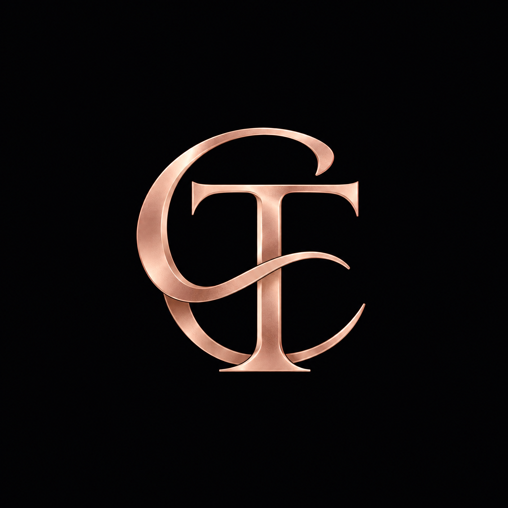

# 💍 Nosso Amor — 6 Anos de História

> Uma experiência digital criada para celebrar 6 anos de amor, cumplicidade, memórias e momentos que construímos juntos. ❤️

<p align="center">
  
</p>

<p align="center">
  <strong>Carlos & Thauana</strong><br>
  <i>6 anos de uma história que continua sendo escrita.</i>
</p>

---

## ✨ Sobre o Projeto

**Nosso Amor** é uma experiência web interativa desenvolvida especialmente para celebrar nossa história de 6 anos.

A proposta foi transformar memórias, momentos e sentimentos em uma experiência digital única, combinando **design minimalista, animações suaves e uma narrativa visual**.

O projeto apresenta uma linha do tempo da nossa história, registros de momentos especiais, galeria de memórias e detalhes pensados para tornar a experiência mais pessoal e significativa.

Mais do que um site, este projeto representa uma forma diferente de guardar e reviver momentos importantes da nossa história. ❤️

---

## 💫 Destaques

* 💕 Linha do tempo com momentos importantes da nossa história
* 📸 Galeria de memórias e fotografias
* ✨ Animações e transições suaves
* 🎨 Interface minimalista e elegante
* 📱 Design totalmente responsivo
* 💻 Experiência otimizada para desktop e dispositivos móveis
* 🎵 Elementos interativos para tornar a experiência mais imersiva
* 💍 Identidade visual personalizada para o casal

---

## 🛠️ Tecnologias

O projeto foi desenvolvido utilizando tecnologias modernas do ecossistema Front-End:

| Tecnologia        | Utilização                            |
| ----------------- | ------------------------------------- |
| **React** | Construção da interface e componentes |
| **JavaScript** | Lógica e interatividade da aplicação |
| **Vite** | Desenvolvimento e build da aplicação |
| **Tailwind CSS** | Estilização e responsividade |
| **GSAP** | Animações e efeitos visuais |
| **ScrollTrigger** | Animações baseadas na rolagem |
| **Lucide React** | Ícones da interface |
| **Vercel** | Deploy e hospedagem |

## 🎨 Identidade Visual

A identidade visual foi desenvolvida com uma estética delicada e sofisticada, utilizando:

* Tons **rose-gold**
* Tons neutros e claros
* Tipografia elegante
* Espaçamentos amplos
* Microinterações
* Animações suaves
* Elementos visuais inspirados em fotografia e memórias

A intenção foi criar uma experiência visual romântica sem abrir mão de uma interface moderna e minimalista.

---

## 📂 Estrutura do Projeto

```text
nosso-amor/
├── public/
│   ├── images/
│   └── favicon-c-t.png
│
├── src/
│   ├── components/
│   ├── sections/
│   ├── assets/
│   ├── App.tsx
│   └── main.tsx
│
├── package.json
├── vite.config.ts
├── tailwind.config.ts
└── README.md
```

---

## 🚀 Como Executar Localmente

### 1. Clone o repositório

```bash
git clone https://github.com/CARLOSEMANUEL0112/nosso-amor.git
```

### 2. Acesse a pasta

```bash
cd nosso-amor
```

### 3. Instale as dependências

```bash
npm install
```

### 4. Inicie o servidor de desenvolvimento

```bash
npm run dev
```

Depois, acesse o endereço exibido pelo Vite no terminal, normalmente:

```text
http://localhost:5173
```

---

## 🌐 Projeto Online

🚧 **Em breve**

O projeto será disponibilizado online através da Vercel.

---

## 📱 Responsividade

A aplicação foi desenvolvida pensando em diferentes tamanhos de tela:

* 📱 Smartphones
* 📲 Tablets
* 💻 Notebooks
* 🖥️ Monitores maiores

Toda a interface foi construída para proporcionar uma experiência consistente independentemente do dispositivo utilizado.

---

## ❤️ Propósito

Alguns projetos são criados para resolver problemas.

Outros são criados para contar histórias.

**Nosso Amor** foi criado para guardar uma.

Seis anos de momentos, aprendizados, desafios, risadas, carinho e memórias que fizeram parte da nossa caminhada.

E essa história ainda continua sendo escrita. ✨

---

## 👨‍💻 Desenvolvido por

**Carlos Emanuel**

Desenvolvedor Front-End

[GitHub](https://github.com/CARLOSEMANUEL0112)

---

<p align="center">
  Feito com ❤️, código e muitas memórias.
</p>
